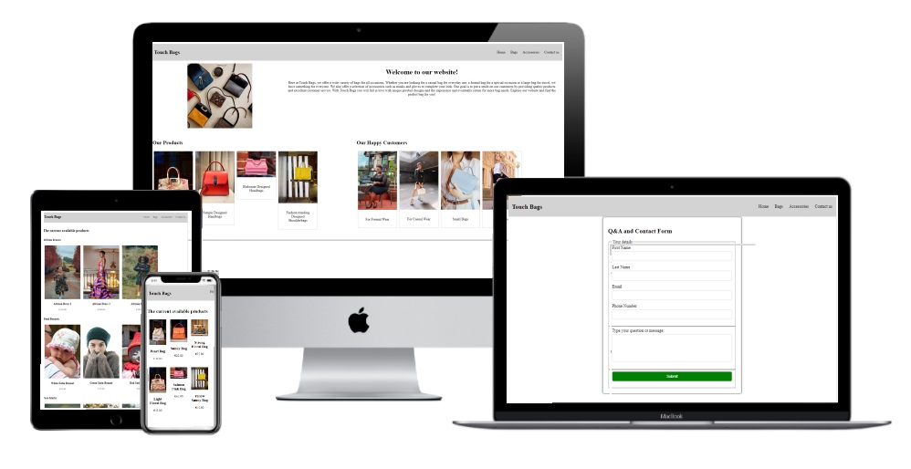

# Touch Bags

Welcome to Touch Bags! Your one-stop destination for stylish bags and accessories. This README provides an overview of the Touch Bags website, its features, testing, and more.

## Overview
Touch Bags is a virtual storefront that aims to provide a pleasant shopping experience for anyone seeking high-quality bags and accessories. The website is designed to showcase our diverse product range while allowing users to easily navigate through different sections and place orders. Whether you're looking for the perfect bag or stylish accessories, Touch Bags has you covered.

## Features

### Navigation
The navigation bar, present on all pages, offers easy access to the Home, Bags, Accessories, and Contact Me pages. This consistent navigation structure ensures smooth navigation for users.

### Home Page
The Home Page welcomes visitors with a brief company introduction. It includes two sections: one displaying images of happy customers with our products, and the other showcasing a selection of our featured products.

### Bags Page
The Bags Page presents an enticing gallery of the bags available for purchase. Each bag is showcased with high-quality images and a concise description. At the bottom of the page, a user-friendly order form allows customers to select their desired bags and place orders.

### Accessories Page
Similar to the Bags Page, the Accessories Page displays a gallery of available accessories for users to explore. Users can browse through the accessories, select their favorites, and place orders using the provided form.

### Contact Me Page
The Contact Me Page features a form where users can engage in Q&A, make inquiries, and submit requests. This interactive form encourages communication and engagement with customers.

### Footer
Every page includes a footer section with contact information. This allows users to easily get in touch with me through social media

## Testing
I have tested the Touch Bags website to ensure its functionality and responsiveness.
From Google Chrome, Microsoft Edge and Firefox I tested the website to ensure consistency accross multiple browsers. Furtherefmore, I tested using developer tools ensuring its structure was acceptable on multiple devices. The same test was performed on https://responsivedesignchecker.com/. 

### Validator Testing
HTML: The website successfully passed through the official W3C validator without errors.
CSS: The CSS code was validated using the official (Jigsaw) validator and was found to be error-free.

# Known Bugs
I am aware of a minor bug in the header section of the main page, which doesn't display optimally on small screens. 

## Deployment
The Touch Bags website is deployed on GitHub and can be accessed at https://davidmonteiro.github.io/touch-bags/.

Feel free to explore the website, browse through the displayed products, and get in touch with me for any inquiries or orders!

Thank you for visiting Touch Bags!
